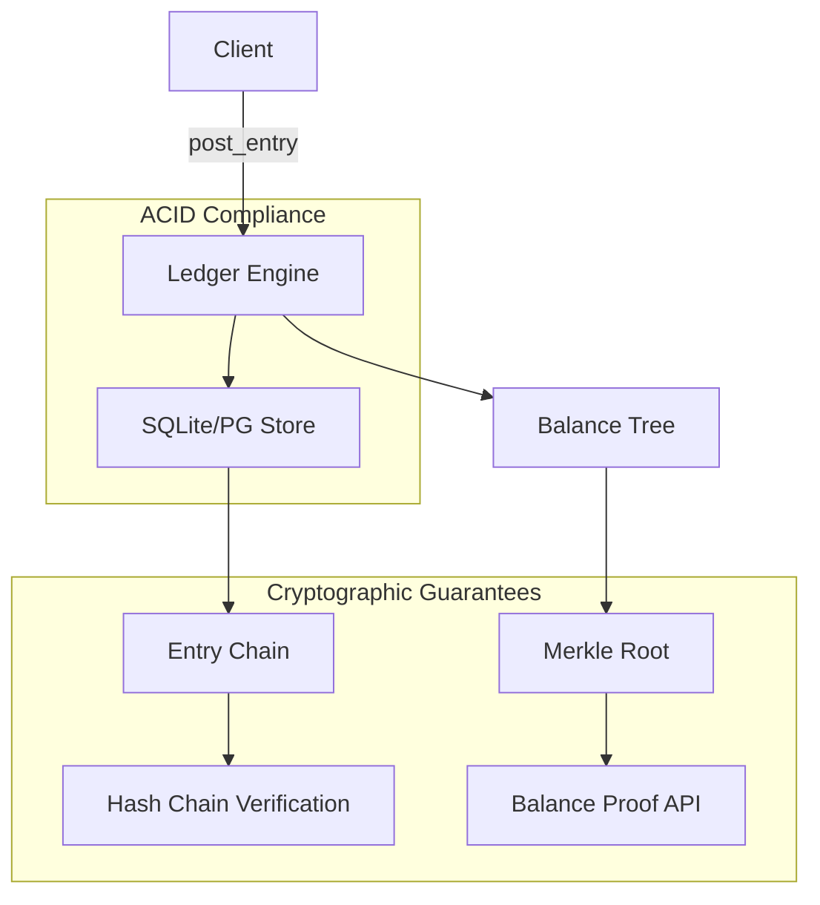

# Architecture: Immutable Double-Entry Ledger

## Design Philosophy
Built on three unshakeable principles:
1. **Cryptographic Verifiability** — Every state transition is hash-chained and Merkle-provable
2. **Double-Entry Conservation** — System-wide Σ(debits) - Σ(credits) = 0 at all times
3. **Deterministic State** — Given the same journal, any replica computes identical state

## System Overview

## Architectural Decision Records

ADR-001: MicroDollar Precision

Decision: All monetary values stored as i64 in micro-dollars (10^-8 dollars).
Rationale: Eliminates IEEE 754 non-determinism. Full dollar range ±$92 trillion.

ADR-002: Hash-Chained Entries

Decision: Every journal entry contains parent_hash linking to previous entry.
Rationale: Creates immutable audit trail. Tampering with any historical entry breaks the chain.

ADR-003: Merkle Balance Tree

Decision: Account balances organized in Merkle tree with proofs.
Rationale: Allows light clients to verify their balance without downloading entire ledger.

ADR-004: Rust + SQLite

Decision: Rust for safety-critical logic, SQLite for portable ACID storage.
Rationale: Path to Postgres via rusqlite feature flags. Zero-cost abstractions for balance computation.
